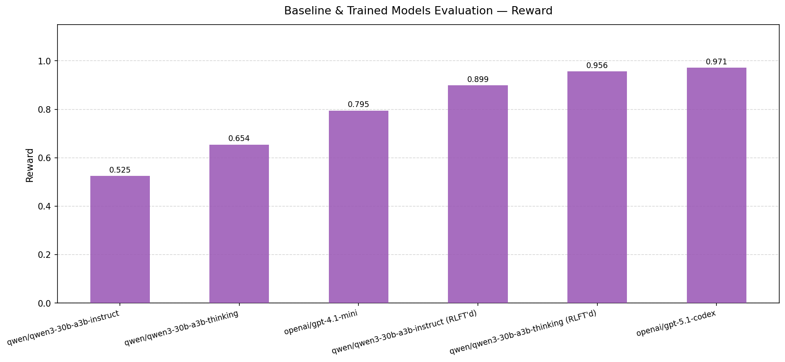
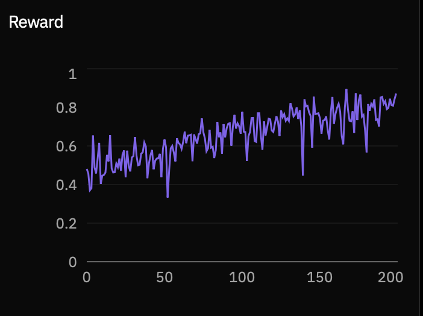

# CausalReasoningEnv

A workspace for building causal reasoning RL training environments using Prime Intellect's [verifiers](https://github.com/PrimeIntellect-ai/verifiers) framework.

The environment trains models to identify causal effects via backdoor adjustment, frontdoor criterion, or instrumental variables using CPT-based DAGs. The focus is on **causal identification** — selecting the correct method, node set, and probability queries — not on computing numerical ATE/LATE values.

## Environment

→ **[`environments/CausalReasoningEnv/`](environments/CausalReasoningEnv/)** — the main package. See its [README](environments/CausalReasoningEnv/README.md) for design details, install instructions, and eval commands.

### Single-Turn Design

The model receives a DAG description and produces a single structured response containing:
- A `<declare method="..." nodes="..."/>` tag specifying the identification method and relevant node set
- 1–3 probability query tags (`<marginal variables="..."/>` or `<conditional query="..." given="..."/>`) specifying the queries needed to compute the causal effect

No tool-calling API is used. All output is plain text with XML self-closing tags parsed by the environment.

### Reward (weights: 0.10 / 0.30 / 0.30 / 0.00 / 0.30)

`format_compliance` / `method_validity` / `set_validity` / `minimality` / `process_correctness`

## Results

See [environments/CausalReasoningEnv/README.md](environments/CausalReasoningEnv/README.md#results) for evaluation plots and RL training curves. Summary below.

**Eval — baseline vs RLFT'd models (ordered weakest → strongest by reward):**



**RL training — qwen/qwen3-30b-a3b-instruct reward curve (200 steps):**



## Repository Structure

```
environments/
  CausalReasoningEnv/              # Main package — load_environment() → CausalATEEnv
    CausalReasoningEnv.py          #   Entry point
    env.py                         #   CausalATEEnv — XML parser, rubric, reward functions
    prompts.py                     #   SYSTEM_PROMPT — XML tag format, examples
    data_generation/
      gen.py                       #   DAG generation, problem sampling, dataset builder
      generate_datasets.py         #   CLI: regenerate and upload datasets
    pyproject.toml
    README.md

configs/
  lab/
    rl_config.toml                 # Training config: CausalReasoningEnv
```

## Setup

```bash
uv sync
prime env install CausalReasoningEnv
```
