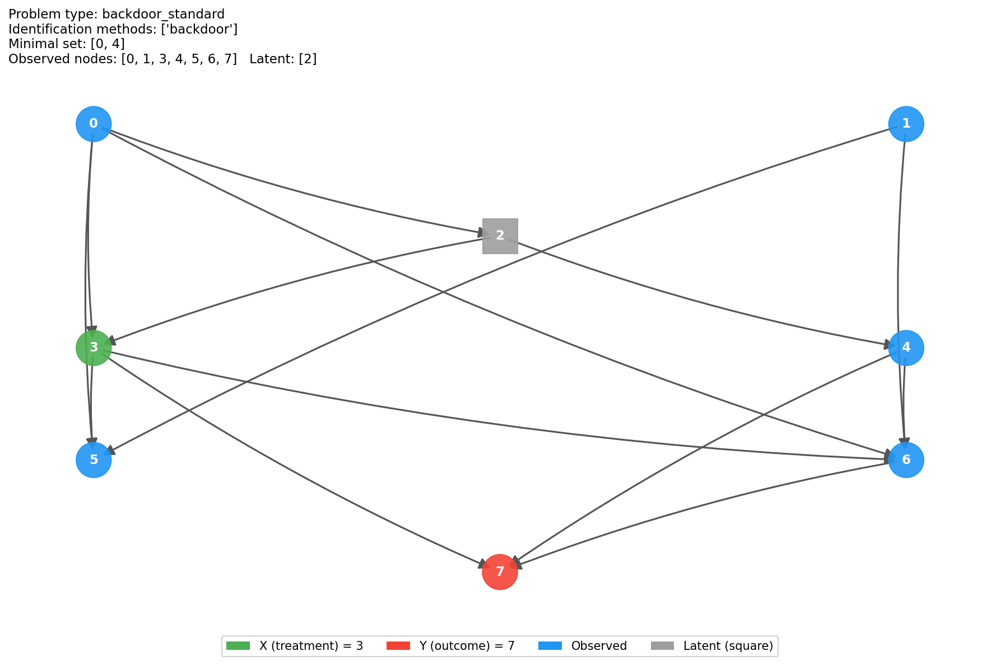
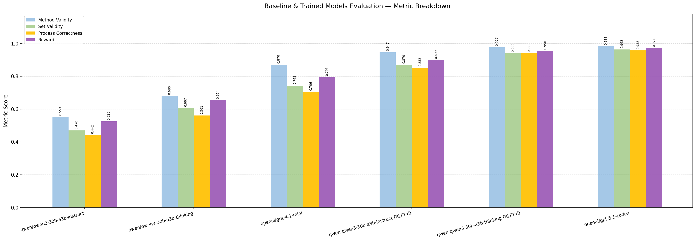
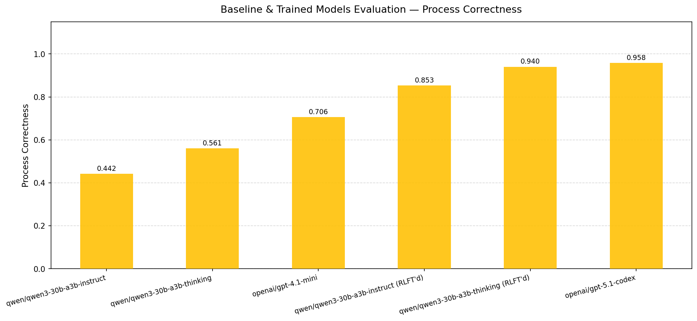

# CausalReasoningEnv

Single-turn causal reasoning benchmark and RL training environment, built with Prime Intellect's [verifiers](https://github.com/PrimeIntellect-ai/verifiers) framework.

The environment trains models to identify causal effects via backdoor adjustment, frontdoor criterion, or instrumental variables over CPT-based DAGs. The focus is on **causal identification** — selecting the correct method, the correct node set, and the correct probability queries — not on computing numerical ATE/LATE values.

---

## Design

### Single-Turn Rollout

The model receives a DAG description and produces **one response** containing:

1. A `<declare method="..." nodes="..."/>` tag committing to an identification method and relevant node set.
2. Between 1 and 3 probability query tags (`<marginal/>` or `<conditional/>`) specifying the queries needed to compute the causal effect under that method.

No tool-calling API is used. All output is plain text with XML self-closing tags parsed directly from the assistant message.

### Output Format

```xml
<reasoning>
...your reasoning here...
</reasoning>
<declare method="backdoor" nodes="1,3"/>
<marginal variables="1,3"/>
<conditional query="6" given="4,1,3"/>
```

```xml
<declare method="frontdoor" nodes="5"/>
<conditional query="5" given="3"/>
<marginal variables="3"/>
<conditional query="7" given="3,5"/>
```

```xml
<declare method="iv" nodes="0"/>
<conditional query="3" given="0"/>
<conditional query="7" given="0"/>
```

### Problem Types

| Type | Fraction | Identification strategy |
|------|----------|------------------------|
| `backdoor_standard` | ~35% | Non-empty minimal adjustment set Z; verified no frontdoor |
| `backdoor_empty` | ~15% | Empty adjustment set (no backdoor confounding); verified no frontdoor |
| `frontdoor` | ~40% | Latent confounder; valid mediator set M (possibly multi-node); verified no backdoor |
| `iv` | ~10% | No backdoor/frontdoor; fresh exogenous IV node Z→X + latent confounder L→X,Y |

Each problem has **exactly one valid identification method** by construction (mutual exclusivity enforced at generation time).

### Reward Rubric

| Component | Weight | Description |
|-----------|--------|-------------|
| `format_compliance` | 0.10 | 1.0 if response has exactly 1 valid `<declare/>`, 1–3 probability query tags, and all node IDs are integers |
| `method_validity` | 0.30 | 1.0 if declared method matches the problem's identification method |
| `set_validity` | 0.30 | 1.0 if declared node set correctly identifies the effect for the declared method |
| `minimality` | 0.00 | 1.0 if set equals `minimal_set`; k/\|declared\| if valid superset (metric only, zero weight) |
| `process_correctness` | 0.30 | Graded score for specifying probability queries that target the right distributions; gated on `set_validity` and `format_compliance` |

`process_correctness` targets per method:

| Method | Targets |
|--------|---------|
| `backdoor_empty` | `conditional(Y \| X)` |
| `backdoor_standard` | `marginal(Z)` + `conditional(Y \| X,Z)` |
| `frontdoor` | `conditional(M \| X)` + `marginal(X)` + `conditional(Y \| X,M)` |
| `iv` | `[marginal(Z,Y) or conditional(Y\|Z)]` + `[marginal(Z,X) or conditional(X\|Z)]` |

---

## Results

### Example Problem — DAG Visualization

A `backdoor_standard` problem from the eval set: 8 nodes (one latent, shown as a square), treatment X=3 (green), outcome Y=7 (red), minimal adjustment set {0, 4}.



### Evaluation — Baseline & RLFT'd Models

Metric breakdown (method validity, set validity, process correctness, reward) across baseline and RLFT'd models, ordered weakest → strongest by reward. RLFT models are trained in our environment for 200 steps on our training dataset.






### RL Training — qwen/qwen3-30b-a3b-instruct

Reward curve over 200 training steps, rising from ~0.4 to ~0.85.


---

## Install

```bash
prime env install CausalReasoningEnv
```

Or from source:

```bash
prime env install CausalReasoningEnv -p ./environments
```

---

## Quickstart

### Run eval

```bash
prime eval run CausalReasoningEnv
prime eval run CausalReasoningEnv -m openai/gpt-4.1-mini -n 50 -r 1
```

### Regenerate dataset

```bash
cd environments/CausalReasoningEnv
python data_generation/generate_datasets.py --n 1000 --save-local
python data_generation/generate_datasets.py --n 1000 --push-hub
```

### Train

```bash
prime rl run configs/lab/rl_config.toml
```

---

## File Structure

```
CausalReasoningEnv/
  CausalReasoningEnv.py           # load_environment() entry point
  env.py                          # CausalATEEnv — XML parser, rubric, reward functions
  prompts.py                      # SYSTEM_PROMPT — XML tag format and examples
  data_generation/
    gen.py                        # DAG generation, problem sampling, dataset builder
    generate_datasets.py          # CLI: regenerate and upload datasets
  pyproject.toml
  README.md
```
---

## Dependencies

Declared in `pyproject.toml`: `verifiers>=0.1.9.post3`, `networkx>=3.0`, `datasets`.
